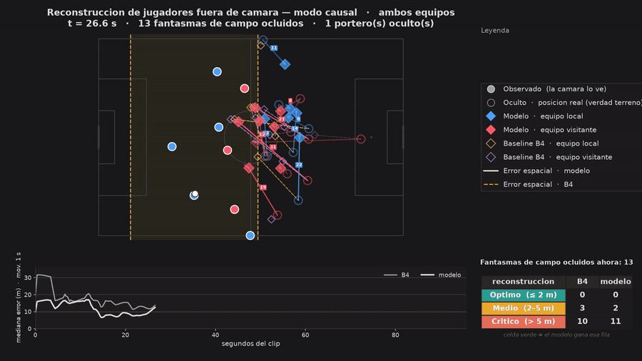

# Ghosting — imputación de jugadores fuera de cámara




Reconstrucción de las posiciones de los jugadores que la cámara de televisión
**no muestra**, a partir de los que sí muestra.

La cámara principal de un broadcast paneá siguiendo al balón y enseña entre 10
y 16 de los 22 jugadores en cualquier instante. Toda métrica espacial calculada
sobre ese subconjunto —control de cancha, compacidad del bloque, valor del
espacio— está sesgada por dónde apuntó el camarógrafo, no por lo que pasó en el
campo. Este proyecto mide ese sesgo y lo corrige.

---

## Resultado principal

```
Bundesliga · 7 partidos · leave-one-match-out · modo causal (online)

    error global    7.68 m → 4.15 m    −46%     +3.54 m [+3.28, +3.83]
    bin >9.6 s     11.51 m → 7.13 m    −38%     +4.04 m [+3.46, +4.66]
    consistencia:  7/7 partidos mejoran en los cuatro regímenes

Test congelado · Metrica · otro proveedor, otra liga, nunca visto

    metrica_1       9.64 m → 7.23 m    −25%
    metrica_2       8.10 m → 5.00 m    −38%
    consistencia:  14/14 evaluaciones positivas
```

Todo con datos abiertos, GPU gratuita y bootstrap pareado de bloques.

**Antes de citar cualquier cifra, lee
[`docs/00_CONTEXTO.md` §5](docs/00_CONTEXTO.md), que dice qué NO se puede
afirmar.**

---

## Estado

| Paso | Qué hace | Estado | Hardware |
|---|---|---|---|
| 0 | Carga y esquema canónico (Sportec, Metrica, sintético) | ✅ | CPU |
| 1 | Simulador de cámara + reporte de oclusión | ✅ | CPU |
| 2 | Escalera de baselines B0–B5 + métricas con IC | ✅ | CPU |
| 3 | Modelo residual aprendido | ✅ | GPU |
| 4 | Validación cruzada leave-one-match-out | ✅ | GPU (~2 h) |
| 5 | Test externo congelado | ✅ | minutos |
| 6 | Figura de tres paneles (pitch control) | ✅ | CPU |
| 7 | Calibración del viewport con SkillCorner | ⬜ | CPU |
| 8 | Modelo generativo (distribución, no punto) | ⬜ | GPU |

---

## Instalación y uso

```bash
./setup.sh --torch          # entorno + PyTorch
source venv/bin/activate
./run.sh test               # 72 tests
./run.sh demo               # verificación sin red, ~1 min
```

Runbook completo en [`docs/08_como_correr.md`](docs/08_como_correr.md),
incluida la parte de Kaggle.

---

## Documentación

| Documento | Contenido |
|---|---|
| [`00_CONTEXTO.md`](docs/00_CONTEXTO.md) | **Empezar aquí.** Qué es, por qué, y qué no se puede afirmar |
| [`01_arquitectura.md`](docs/01_arquitectura.md) | Estructura del código y flujo de datos |
| [`02_formalismo_matematico.md`](docs/02_formalismo_matematico.md) | El problema, los estimadores, las pérdidas |
| [`03_modelo_de_camara.md`](docs/03_modelo_de_camara.md) | Simulador de viewport y su calibración |
| [`04_protocolo_evaluacion.md`](docs/04_protocolo_evaluacion.md) | Métricas, estratificación, bootstrap pareado |
| [`05_roadmap.md`](docs/05_roadmap.md) | Qué falta |
| [`06_resultados.md`](docs/06_resultados.md) | **Todos los números con sus intervalos** |
| [`07_modelo_aprendido.md`](docs/07_modelo_aprendido.md) | El imputador residual en detalle |
| [`08_como_correr.md`](docs/08_como_correr.md) | Runbook completo, local y Kaggle |
| [`09_decisiones_y_errores.md`](docs/09_decisiones_y_errores.md) | **Bitácora de bugs y por qué el código es así** |

> **Si eres una IA que recibe este repositorio**, lee `00_CONTEXTO.md` y
> `09_decisiones_y_errores.md`. El segundo contiene los errores que ya se
> cometieron; evitar repetirlos vale más que cualquier explicación de lo que
> funciona.

---

## Datos

| Fuente | Contenido | Rol |
|---|---|---|
| Sportec / DFL (IDSSE) | 7 partidos Bundesliga 1–2, TRACAB gen-5, 25 fps | Entrenamiento y CV |
| Metrica Sports | 2 partidos | **Test externo congelado** |
| SkillCorner opendata | 10 partidos A-League, tracking de broadcast real | Calibrar el simulador (pendiente) |
| Sintético | Generado localmente | Tests y prueba del pipeline |

SkillCorner **no** sirve como verdad de terreno: ya tiene los huecos y no
contiene a los jugadores ausentes. Es el problema, no la solución. Su valor es
que contiene la máscara de oclusión **observada**.

---

## Modelos entrenados

Los pesos entrenados **no se distribuyen** en este repositorio. El código para
regenerar los 7 folds de validación cruzada sí está incluido:

```bash
./run.sh cv   # ~2 h en GPU; genera reports/cv/fold_<MATCH>.pt
```

Cada checkpoint lleva dentro su configuración (`ck['args']`), curva de
entrenamiento (`ck['history']`) y el error de B4 en su conjunto de validación.

---

## Trabajo previo

- **Omidshafiei, S. et al. (2022).** "Multiagent off-screen behavior prediction
  in football." *Scientific Reports* 12:8638. DeepMind + Liverpool FC.
- **Choi, S. (2026).** "Training-Free Off-Screen Player Imputation for
  Broadcast-Based Spatial Football Analytics." arXiv:2607.11548.
- **Le, H. M., Carr, P., Yue, Y., Lucey, P. (2017).** "Data-Driven Ghosting
  using Deep Imitation Learning." MIT Sloan.
- **Spearman, W. et al. (2017).** "Physics-based modeling of pass probabilities
  in soccer." MIT Sloan.
- **Bassek, M. et al. (2025).** "An integrated dataset of spatiotemporal and
  event data in elite soccer." *Scientific Data* 12:195.

---

## Licencia

Código propio bajo [AGPL-3.0](LICENSE). Los datos de cada proveedor conservan
su licencia original; revísalas antes de redistribuir cualquier derivado.

Para uso comercial con código cerrado, contactar al autor.

https://github.com/user-attachments/assets/0692ade4-1dd8-4503-9b05-def6b61978d8
